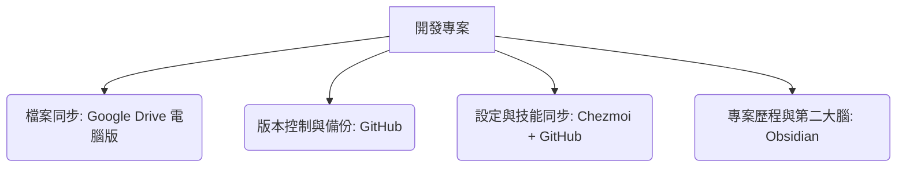

# AI Agent 協調工作與跨裝置同步實戰報告
> **資料來源**：[AI Agent 觀測站 EP06 ｜ Agent協調工作與專利](https://youtu.be/mnFdJaAmeUM)
> **整理時間**：2026年8月10日

---

## 1. 執行摘要 (Executive Summary)

本報告深入解析影片中分享的 **AI Agent 跨裝置、跨模型協同工作流**。當開發者在單一電腦或多台裝置上使用多個 AI Agent（如 Claude Code, ChatGPT App, OpenCode, Antigravity 等）開發同一個專案時，常面臨「設定不同步」、「進度無法延續」、「上下文遺失」等痛點。

影片中提出了一套結合 **雲端硬碟（Google Drive 電腦版）**、**版本控制（GitHub）**、**第二大腦（Obsidian）** 與 **設定管理工具（Chezmoi）** 的完整解決方案，並設計了「**初始化**」、「**開工**」、「**收工**」與「**交接 (Handoff)**」四大核心技能，實現了無縫的 AI 協作生態。

---

## 2. 核心痛點與挑戰

在多 Agent 時代，開發者在進行複雜專案時通常會遇到以下瓶頸：
- **跨裝置同步難度高**：在桌機與筆電之間切換時，專案檔案與 Agent 的設定（全域指令、自訂技能）無法自動同步。
- **Agent 上下文斷代**：不同的對話 Session 或是不同的 Agent（例如從 Claude 切換到 ChatGPT）無法得知前一個 Agent 做到哪裡，導致需要重複輸入提示詞。
- **工具鏈破碎**：缺乏統一的「專案藍圖」，Agent 進入專案目錄後處於盲目狀態，容易偏離開發方向。

---

## 3. 三維同步解決方案 (Three-Dimensional Sync Solution)

影片中設計了一套三維度的同步架構，分別解決**專案檔案**、**大腦筆記**以及**配置技能**的同步問題：



### 3.1 檔案同步：Google Drive 電腦版
* **關鍵做法**：必須使用**電腦版雲端硬碟應用程式**（將雲端硬碟掛載為本地磁碟，如 `G:\` 或 `I:\`），**不可直接使用網頁版**。
* **優勢**：所有 Agent 在該虛擬磁碟中讀寫檔案時，檔案會即時同步至雲端，確保不同電腦上存取的專案檔案完全一致。

### 3.2 設定與技能同步：Chezmoi
* **關鍵做法**：使用開源的 Dotfiles 管理工具 **Chezmoi**，並以 GitHub 私人儲存庫（Private Repo）作為雲端備份空間。
* **優勢**：當在 A 電腦更新了 Agent 的「全域設定」或「自訂技能」時，Chezmoi 會自動將設定推送到 Git。在 B 電腦上只需執行 `chezmoi update`，即可瞬間完成技能同步。

### 3.3 專案歷程與第二大腦：Obsidian
* **關鍵做法**：在專案初始化時，同步於 Obsidian（基於 Markdown 的本地筆記軟體）建立對應的專案目錄與筆記。
* **優勢**：將專案的歷史脈絡、踩坑記錄和架構設計以 Markdown 格式沉澱至「第二大腦」，方便日後非 Agent 狀態下的人工作業與知識檢索。

---

## 4. Agent 專案生命週期管理

為了解決 Agent 盲目工作的問題，影片作者開發並開源了三個核心自訂技能（自訂指令），這也是引導 Agent 自動化管理專案生命週期的精髓：

### 4.1 專案初始化 (Initialization)
當專案開始時，執行此技能，Agent 會自動：
1. 在專案根目錄建立專案藍圖檔案 `agents.md`（或 `Claude.md`），定義專案目標、架構與技術棧。
2. 建立 `.gitignore` 檔案，確保敏感與無用資訊（如金鑰、暫存檔）不會被上傳。
3. 自動在 GitHub 上建立對應的程式碼倉庫（Repo）。
4. 在 Obsidian 中建立專案的第二大腦筆記目錄。

### 4.2 開工 (Start Work)
每次開啟新的 Agent 對話或換電腦時，第一步輸入 `開工`。Agent 會自動：
1. 執行 `chezmoi update` 同步最新的全域設定與技能。
2. 讀取專案藍圖 `agents.md`，理解專案背景。
3. 讀取交接檔案 `handoff.md`，了解前一次工作的進度、未完成事項與當前狀態。
4. 提示開發者接下來的行動建議。

### 4.3 收工 (Stop Work / Finish)
當工作告一段落時，輸入 `收工`。Agent 會自動：
1. 更新專案藍圖 `agents.md` 中的進度狀態。
2. 將變更提交（Commit）並推送（Push）至 GitHub。
3. 更新 Obsidian 中的工作日誌。
4. **自動產生 `handoff.md`**，詳細記錄本次工作的改動、未完成的待辦清單（Todo List）及已知的技術限制。

---

## 5. 跨 Agent 協作模式 (Cross-Agent Collaboration)

這套系統最精妙之處在於支援**跨模型協作（例如 Claude 編寫代碼，ChatGPT 審查代碼）**：

```
[Claude Code] 工作中 ──> 寫入 handoff.md ──> 執行 [收工] ──> 同步至雲端
                                                               │
                                                               ▼
[ChatGPT App] ──> 執行 [開工] ──> 讀取 handoff.md ──> 審查/修改 ──> 執行 [收工]
```

1. **創造者角色 (Creator)**：例如使用 `Claude Code` 快速生成代碼與功能。工作完畢後呼叫 `收工` 產生 `handoff.md`。
2. **審查者角色 (Auditor)**：在同一個目錄下開啟 `ChatGPT`，輸入 `開工`。ChatGPT 讀取 `handoff.md` 後，針對 Claude 的代碼進行代碼審查（Code Review）、安全檢查與邏輯優化。
3. **優化循環**：ChatGPT 審查完畢後，將修改意見與下一步計畫寫入新的 `handoff.md`並 `收工`。接著再回到 `Claude` 執行 `開工` 繼續修正，形成強大的多模型協作迴圈。

---

## 6. 已知限制與優化策略

1. **雲端硬碟頻繁讀寫限制**：
   * *問題*：Google Drive 或 OneDrive 在面對高頻率、小檔案的讀寫時，可能會因為 API 限制而阻斷同步。
   * *優化*：若專案較大，Agent 會自動在本地 C 槽建立臨時暫存資料夾，待大部分工作完成後再批次 Copy 回雲端硬碟。
2. **Token 消耗與上下文大小**：
   * *問題*：每次開工都讀取大量 Obsidian 歷史與專案藍圖，會迅速撐爆上下文（Context Window）並消耗昂貴的 Token。
   * *優化*：非必要時避免讓 Agent 讀取整個 Obsidian 目錄，僅讀取最核心的 `agents.md` 與 `handoff.md` 即可。

---

## 7. 結論

本集影片展示的並非單純的工具使用，而是一種**將 AI Agent 視為真正團隊成員的「協同工作規範」**。藉由將**檔案同步、版本控制、知識筆記與交接清單**標準化，開發者能夠大幅解放 AI Agent 的潛能，實現一人多機、多模型高效並行開發的未來工作模式。
